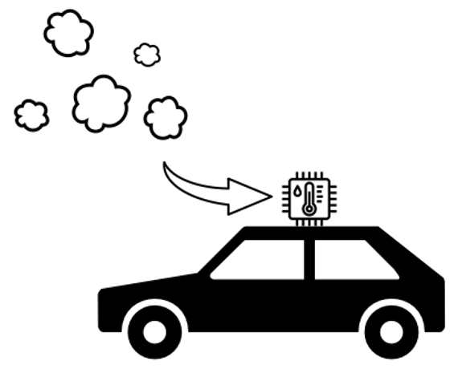

# AirFleet
Mobil kortlægning af luftkvalitet

## Formål
Formålet med dette projekt er at udvikle en IoT-løsning, der kan indsamle samples af luftkvalitet, herunder partikler, fugtighed, temperatur, CO2 baseret på GPS-lokation.

Enheden skal kunne installeres udvendigt (evt. ved luftindtag) på en bil.

Indsamlede data skal leveres til en webservice, hvor de skal gemmes i en database til efterfølgende analyse.

Der skal være et display på IoT-enheden, som giver mulighed for at informere føreren af bilen om luftkvalitet. 

Optimalt set vil IoT-enheden automatisk aktivere recirkulation i bilen ved lav luftkvalitet.